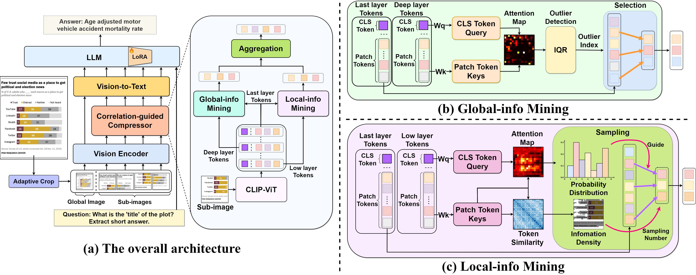

<div align="center">
<h2 class="papername"> Token-level Correlation-guided Compression for Efficient Multimodal Document Understanding </h2>
<div>
    <a href="#" target="_blank">Renshan Zhang*</a>,
    <a href="#" target="_blank">Yibo Lyu*</a>,
    <a href="https://rshaojimmy.github.io/" target="_blank">Rui Shao†</a>,
    <a href="https://scholar.google.com/citations?user=Mpg0w3cAAAAJ" target="_blank">Gongwei Chen</a>,
    <a href="http://faculty.hitsz.edu.cn/guanweili" target="_blank">Weili Guan</a>,
    <a href="https://liqiangnie.github.io/" target="_blank">Liqiang Nie†</a>
</div>
School of Computer Science and Technology, Harbin Institute of Technology, Shenzhen<br>
*Equal contribution
†Corresponding author

[](https://arxiv.org/abs/2407.14439) 

</div>

## Updates
- [07/2024] [Arxiv paper](https://arxiv.org/abs/2407.14439) released.

## :fire: The codes will be released soon

<div align="center">

</div>


## Citation

If you find this work useful for your research, please kindly cite our paper:

```
@misc{zhang2024token,
      title={Token-level Correlation-guided Compression for Efficient Multimodal Document Understanding}, 
      author={Renshan Zhang, Yibo Lyu, Rui Shao, Gongwei Chen, Weili Guan and Liqiang Nie},
      year={2024},
      eprint={2407.14439},
      archivePrefix={arXiv},
      primaryClass={cs.CV},
      url={https://arxiv.org/abs/2407.14439}, 
}
```
